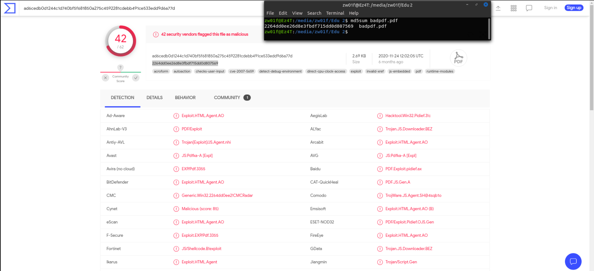

<<<<<<< HEAD
# Requirements
=======
# Requirements 
>>>>>>> 4024f765da5cd735308f9d6427530fc82cdc0828

- **[PySimpleGUI](https://github.com/PySimpleGUI)**

```
python -m pip install PySimpleGUI
```
<<<<<<< HEAD

- **scikit-learn version 0.21.3 or lower**

```
pip install -U scikit-learn==0.21.3
```

- [Download](https://github.com/ZW01f/Ai_project_2021/tree/main/important_files) and put them in the same Directory with **MainPROG**

* * *
# Using the  program :

1.  run the script
2.  use the browser button and select the file you want to analyze
3.  press submit button to pass the file into the script
4.  press start to begin the analysis processing

## Demo :

## Test files on [virustotal](https://www.virustotal.com/gui/) 



# pogram Details

- After Holding the PDF file by browsing form, The program passes it to [**PDFID**](https://github.com/ZW01f/Ai_project_2021/blob/main/important_files/pdfid.py) script then calls the **Feature-extract** function to extract and reformat features to an array .
- next, we give that array to [**AI-Modul**](https://github.com/ZW01f/Ai_project_2021/blob/main/MachineLearningModel/Malicious_Detection.ipynb) to analyze the file
- lastly, print the status that if the file is **clean** or **malicious**.

# Data set

- All files we used is owned by **Mila parkour**, and you can download it from [contagiodump](http://contagiodump.blogspot.com/2013/03/16800-clean-and-11960-malicious-files.html) .
    
- Extracted data in **dataset.csv** based on [**pdfid**](https://www.aldeid.com/wiki/Pdfid) and you can find the complete script in the repository.
    

# key words (features) meaning :

| Name | Description |
| --- | --- |
| /AA | Automatically execute an action or a script |
| /AcroForm | Adobe Forms. Can launch scripts or actions |
| /Action | Can launch scripts or actions |
| /Encrypt | indicates that the PDF document has DRM or needs a password to be read. |
| /JavaScript | Embeds JavaScript code in an object |
| /JBIG2Decode | Used for images |
| /JS | Embeds JavaScript code in an object |
| /Launch | Launches a program or opens a document |
| /Names | Can launch scripts or actions |
| /ObjStm | Can hide objects in an object stream |
| /OpenAction | Automatically execute an action or a script |
| /Page | Number of pages in the PDF file |
| /RichMedia | Embeds rich media (e.g. Flash) in an object |


# papers and tools .

- [PDFID blog](https://blog.didierstevens.com/programs/pdf-tools/)
- [PDF-malware detection:a survey and taxonomy of current techniques](https://core.ac.uk/download/pdf/188824539.pdf)
- [MLPdf: An Effective Machine Learning BasedApproach for PDF Malware Detection](https://arxiv.org/pdf/1808.06991.pdf)


=======
-	**scikit-learn version 0.21.3** 
```
pip install -U scikit-learn==0.21.3
```
- [Download](https://github.com/ZW01f/Ai_project_2021/tree/main/important_files) and put them in the same Directory with **MainPROG** 
>>>>>>> 4024f765da5cd735308f9d6427530fc82cdc0828
